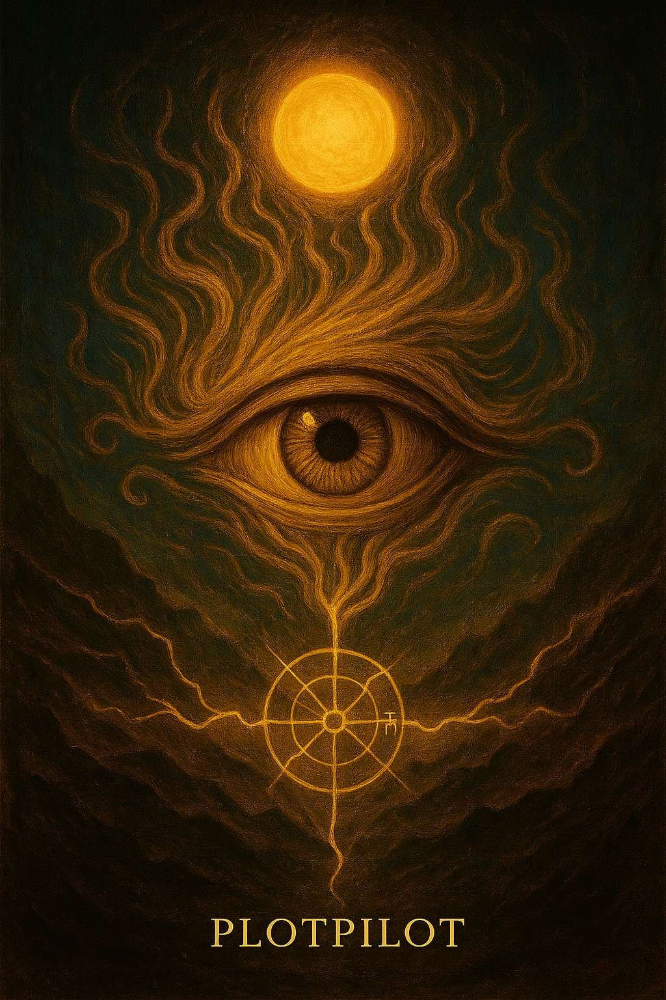

# The Grand Quest - Novel Reader Web Page
https://tgq.netlify.app/

A custom-built web application for reading my fantasy fiction novel *The Grand Quest*, combining my passion for writing with web development.

## Features

- 📖 **Chapter System**: Dynamic loading of Markdown-formatted chapters
- 🌗 **Theme Toggle**: Light/dark mode with localStorage persistence
- 📱 **Responsive Design**: Optimized for both desktop and mobile
- 🔄 **Reading Progress**: Remembers last chapter and scroll position
- 📜 **Sidebar Navigation**: Easy chapter selection menu
- ✨ **Animations**: Smooth transitions between chapters and pages

## Technical Stack

- **Frontend**: HTML5, CSS3, JavaScript (vanilla)
- **Libraries**: 
  - [marked.js](https://marked.js.org/) - Markdown rendering
  - [Font Awesome](https://fontawesome.com/) - Icons
  - [Google Fonts](https://fonts.google.com/) - Custom typography
- **Features**:
  - CSS variables for theming
  - Custom scrollbar styling
  - Loading animations and transitions
  - Progressive enhancement approach

## About the Project

As both a writer and developer, I created this project to:
- Share my fantasy fiction novel with readers
- Showcase my frontend development skills
- Combine my creative writing with technical implementation
